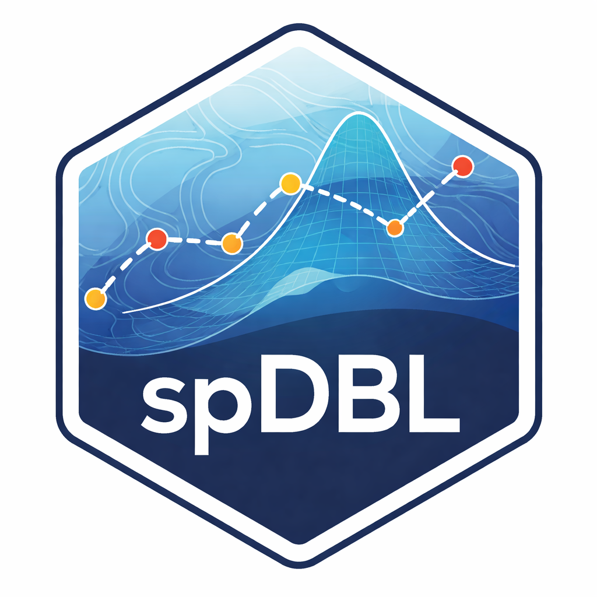

# spDBL <a href="https://github.com/xiangchen-stat/spDBL"></a>

<!-- badges: start -->
[](https://github.com/xiangchen-stat/spDBL)
[](https://jmlr.org/papers/v26/22-0896.html)
[](https://github.com/xiangchen-stat/spDBL/blob/main/LICENSE.md)
<!-- badges: end -->

## Overview

**spDBL** is an R package for **Dynamic Bayesian Learning for Spatiotemporal Mechanistic Models**. It implements a scalable Bayesian framework for learning complex spatiotemporal dynamical systems by combining **mechanistic modeling**, **Gaussian process emulation**, and **hierarchical state-space models**.

Mechanistic models arising from ordinary differential equations, partial differential equations, and computer simulators are often computationally expensive, making direct Bayesian inference difficult. `spDBL` addresses this challenge by emulating the mechanistic system and then melding emulator output with noisy observations in a hierarchical Bayesian model.

The framework supports:

- **Gaussian process emulation** of mechanistic systems
- **Hierarchical state-space modeling** for spatiotemporal dynamics
- **Closed-form Bayesian updating** in matrix-variate Normal and Wishart models during emulator construction
- **Post-emulation MCMC** for inference on mechanistic parameters
- **Dynamic Bayesian transfer learning** for large-scale emulation

The methodological details are presented in [Banerjee, Chen, Frankenburg, and Zhou (2025)](https://jmlr.org/papers/v26/22-0896.html).

## Installation

### Install from GitHub

```r
# install.packages("pak")
pak::pak("xiangchen-stat/spDBL")
```

You can also install with `devtools`:

```r
# install.packages("devtools")
devtools::install_github("xiangchen-stat/spDBL")
```

### Install from source

To install from a source tarball, download the package source file and run:

```r
install.packages("spDBL_X.X.X.tar.gz", repos = NULL, type = "source")
```

Since `spDBL` contains compiled code, you will need a working C/C++ toolchain on your system. On macOS, this typically means installing Xcode Command Line Tools. On Windows, use Rtools. On Linux, install the corresponding system compilers and development libraries recommended for R package compilation.

## Package scope

`spDBL` is designed for Bayesian learning in settings where a mechanistic model governs spatiotemporal dynamics but repeated direct simulation is too costly for routine inference. Typical applications include:

- inverse problems for nonlinear ODE and PDE systems
- spatiotemporal epidemiologic models
- environmental and ecological dynamical systems
- black-box computer models generating spatial or spatiotemporal output
- transfer learning across related dynamical systems

## Methodological summary

The `spDBL` workflow has four main components:

1. **Mechanistic model runs**  
   Generate training runs from the underlying dynamical system over a finite collection of inputs.

2. **Gaussian process emulation**  
   Learn the relationship between model inputs and system outputs using Gaussian process regression.

3. **Hierarchical spatiotemporal modeling**  
   Embed the emulator in a state-space model to combine mechanistic knowledge with noisy observed data.

4. **Inference on model parameters**  
   Use analytically tractable posterior distributions for emulator construction, followed by MCMC-based inference for mechanistic parameters when needed.

A central advantage of this framework is that the emulator stage avoids expensive iterative Bayesian computation such as full MCMC or variational inference, while still preserving a coherent probabilistic learning framework.

<!-- ## Quick example

```r
library(spDBL)

# Example workflow
# sim_data <- simulate_mechanistic_model(n_runs = 50)
# gp_model <- fit_gp_emulator(sim_data)
# fit <- run_inference(gp_model, observations)

# summary(fit)
```

Please replace the example above with package-specific functions as your API stabilizes. -->

## Related paper

**Dynamic Bayesian Learning for Spatiotemporal Mechanistic Models**  
Sudipto Banerjee, Xiang Chen, Ian Frankenburg, Daniel Zhou  
*Journal of Machine Learning Research*, 26(146):1-43, 2025

### Abstract

We develop an approach for Bayesian learning of spatiotemporal dynamical mechanistic models. Such learning consists of statistical emulation of the mechanistic system that can efficiently interpolate the output of the system from arbitrary inputs. The emulated learner can then be used to train the system from noisy data achieved by melding information from observed data with the emulated mechanistic system. This joint melding of mechanistic systems employ hierarchical state-space models with Gaussian process regression. Assuming the dynamical system is controlled by a finite collection of inputs, Gaussian process regression learns the effect of these parameters through a number of training runs, driving the stochastic innovations of the spatiotemporal state-space component. This enables efficient modeling of the dynamics over space and time.

This article details exact inference with analytically accessible posterior distributions in hierarchical matrix-variate Normal and Wishart models in designing the emulator. This step obviates expensive iterative algorithms such as Markov chain Monte Carlo or variational approximations. We also show how emulation is applicable to large-scale emulation by designing a dynamic Bayesian transfer learning framework. Inference on mechanistic model parameters proceeds using Markov chain Monte Carlo as a post-emulation step using the emulator as a regression component. We demonstrate this framework through solving inverse problems arising in the analysis of ordinary and partial nonlinear differential equations and, in addition, to a black-box computer model generating spatiotemporal dynamics across a graphical model.

Paper link: <https://jmlr.org/papers/v26/22-0896.html>

## Repository structure

```text
R/          R functions
src/        C++ source code
man/        documentation files
tests/      tests
```

## License

This package is released under the **MIT License**.

## Acknowledgement

The hex logo for spDBL was generated with the assistance of ChatGPT (OpenAI) using AI-based image generation tools.
